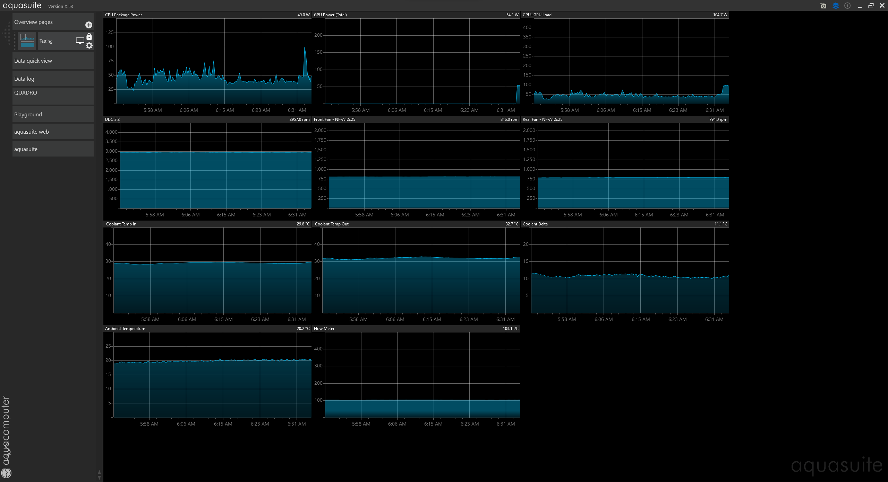
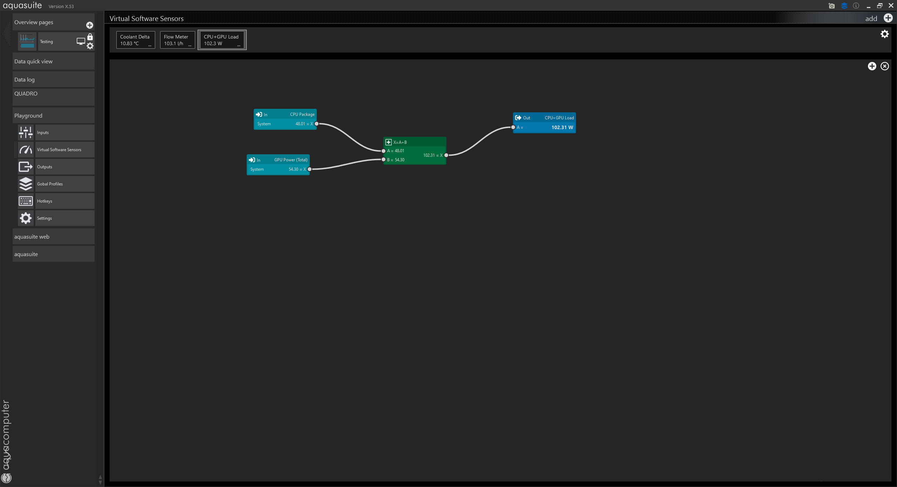
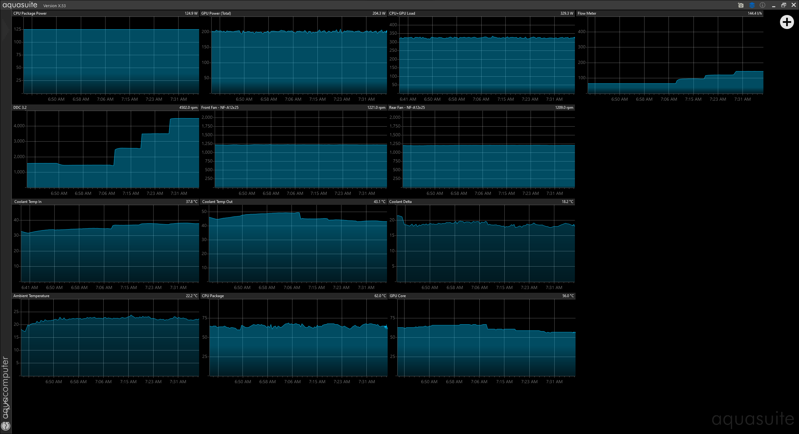

# The Enchiridion of Watercooling.
A short handbook for radiators and fans in SFF.

## Compendium

- [Introduction and Intention](#introduction-and-intention)
- [Test Setup](#test-setup)
- [Testing Methodology](#testing-methodology)
- [Formulating Meaningful Numbers](#formulating-meaningful-numbers)
- [Radiator and Fan Testing](#radiator-and-fan-testing)
- [Results](#results)
- [Summary](#summary)

### Introduction and Intention

Welcome! The intention of this document is to have an ongoing repository for the testing of the many radiators that are recommended for SFF. There's a substantial amount of anecdotal evidence floating around in regards to radiator choice, fan choice and the arrangement of both. With testing and comparison, I hope that this document can serve to inform and guide the choices for SFF Watercooling.

I do feel that I want to establish that the testing conducted is intentionally niche for a few reasons. The radiators and fans tested will largely revolve around compatibility with Sandwich layout cases, Primarily the FormD T1V2. The testing configurations will reflect the compatibility of the T1V2 or similar Sandwich layout cases, i.e. Jimu. This will include the more popular recommended radiators, Fan orientations and the feasibility of Dual Radiator Layouts. That's not to say that I won't test other radiators and fans in the future, I would in fact love to have a large volume of information on the many offerings outside the ones stated. It just isn't a current priority.

The extent of the configurations of Radiator, Fans and Radiator Layout will be elaborated on in later sections. I plan to make all the information as palatable as possible so that all can make use of it. If you have any suggestions or questions, please don't hesitate to reach out, All input is appreciated.

Thank you for your time,

*Nazh*

### Test Setup

The test setup used will be as follows for all of the tests conducted unless stated otherwise.

- 11900KF with Barrow pump-block combo and an EK DDC3.2 Elite
- Gigabyte Z590i Aorus ITX motherboard
- GTX 770 With EK-FC770 GTX DCII - Acetal+Nickel
- G.Skill Trident Z 32GB 3600MHz DDR4 
- Samsung 970 EVO 500GB NVMe Drive
- Corsair SF750 SFX PSU
- GECKO AIR ITX

Fans and Radiators will be changed as needed so they won't be invluded in this list. The fittings used are pneumatic air fittings with an 8mm airline tube to a set of QDC's at the radiator end. I do plan to do a chapter on the use of pnematic fittings in the future as many may be uneasy about their use and understandably so. The testing that I and others have done shows now reason why theyre aren't adequate and in my opinion I believe them to be superior to the bulky offerings available for SFF. 

The radiator is housed in a T1 chassis with no components in it in order to isolate from the system component's passive heat. This helps to ensure the load generated by the CPU and GPU are what the radiator is dissapating which will give better results. The other reason I have decided to house the radiator end of the loop in a T1 chassis is so that I can install the top and side panels in order to create a better representation of the radiators in real world situations. The objective testing doesn't use top or side panels in order to give a truer represtation of what the radiator can do.

As will be explained in the Testing Methodology, There is a set of variables that I aim to keep consistant across the testing. Mainly ambient temperature through the use of AC and Temp Probes as well as multiple coolant temperature sampling points (in order to calculate Coolant Delta). All data logging will be done through an Aquacomputer QUADRO Fan Controller. As you will see further down, This piece of equipment is crucial to this test setup and acts as the backbone to the majority of the data and values that will be represented. 

### Testing Methodology

I would like to use this section to walk you through the theory of my testing and hopefully get you to a place by the end that will give you an intuitive understanding on how to interpret the data I present. I will do this through several stages as a way to refine my own testing methodology, So this may change by the end of writting.

#### Aquasuite

Shown above is a User Interface that I configured to show the data currently being tracked (will most likely evolve with time, Image is mostly for demonstration purposes) for the testing of the fans and radiators. Most should be relatively self explanatory but for the sake of this being educational I will outline some of the more important elements.

The top row, CPU Package Power, GPU Power (Total) and the CPU+GPU Load is the primamry represntation of the Heat Load or Watts for the testing. This value is intened to be fixed throughout the testing in order to provide consistant results. The current Wattage I am looking to test with is 210W on the GPU using Furmark and 125W on the CPU using Prime95. Totalling 325 Watts of heat which I feel is a good representation of the current gaming loads with current CPU and GPU hardware.

As you can see above, Aquasuite allows you to configure Software Virtual Sensors in order to take some of the work out of interpreting the output data. This Software Sensor gives an easier way of tracking the Load of both the CPU and GPU combined. This can be especially helpful for calculating the Average Load across the length of a test in order to ensure consistant results.

If I were to snip out the 30 minute sample for a test and it turned out that the Average Load wasnt within the intended 325W +/- 5% then those results would be discarded and the test would need to be repeated. The use of these Software Sensors serves as an essential part of streamlining the data processing on my end and should help to convey the data to you in a more palattable way.

#### Pump Speed

With the introduction of Aquasuite and the variables presented, I would like to demonstrate how I intend to use the data by working through a series of tests to determine the speed of the DDC pump for the testing going forward.
We will do that by using these data points which should give you an indication on what speed will serve best for testing.
- Pump Speed (RPM)
- CPU Temperature (°C)
- GPU Temperature (°C)
- Ambient Temperature (°C)
- Coolant Temperature In (°C)
- Coolant Temperature Out (°C)
- Coolant Delta (°C) - This is calculated through a Software Sensor by taking the average of the Coolant In/Out and subtracting the Ambient Temperature.
- Fan speed will be fixed at 1200RPM for this test

Testing will proceed as follows.
1. Allow AC to get ambient to the desired temperature (approximately 22°C)
2. Perform 15 minutes of presoak bencharks in order to ensure all coolant is "heatsoaked"
3. Wait another 15 minutes to allow equalisation of temperatures whilst adjusting the test parameters. In this case, A fixed fan Speed (RPM) and a Fixed Pump Speed (RPM).(In this example I did not do this but that will be explained.)
4. Enable both Prime95 and Furmark to achieve the required Test Wattage of 325W
5. Log data for 30 minutes

Whilst there is a lot data presented in this screenshot, The areas of focus will be the Pump RPM, The Coolant In, The Coolant Out and the GPU Core. The Total Load in Watts, The Fan RPM and Ambient Temperature remain mostly consistant through the whole test so they shall be ignored.

What we can see is a series of adjustments to the DDC Pumps Speed (RPM) and the effects that has. The Test begun with the Pump set at 1500 RPM and was changed to 2500 RPM, 3500 RPM and 4500RPM. You can see that even though the Coolant in and Coolant Out change in reaction to the Pump RPM, the Coolant Delta remains practically the same. Why is that? The Coolant Delta, Which is the difference in Coolant Temperature from the Ambient Temperature, Is calculated by take the average of the Coolant In and Coolant Out and subtracting the Ambient Temperature from that. So the changes in the Coolant In and Coolant Out cancel each other out meaning that the coolant is essentially reaching equilibrium quicker by pumping the coolant faster through the loop. The lack of change in Coolant Delta indicates that so far as the In and Out temperature is concerned, The Pump speed is essentially irrelevant (aside from having higher temperature coolant in parts of your loop).

The same cannot be said for the focus of this test, The GPU Core. You can see the reduction of the GPU Core across the length of the test in correlation to the pumps RPM. From 1500 RPM to 2500 RPM we see a reduction from 67°C to 61°C, 2500 RPM to 3500 RPM a reduction from 61°C to 58°C and from 3500 RPM to 4500 RPM a reduction of from 58 to 56°C. We can make assertions from this data regarding what might be considered to be an optimal pump speed or at the very least a bare minimum RPM to operate your pump at. For future testing the pump shall be kept at 3500 RPM as that seems to offer the best improvement on component temperature. There is of course the noise to be taking into consideration which is going to be a higher priority than several degrees on their components, which is completely understandable.

Each loop is going to be different and every person will have their own desires for the information presented in this section. It is not all encompassing but hopefully gives you a primer to conduct some of your own tests to find a pump speed that works for you and your components.

#### Benchmarking Radiators and Fans

As established above, the testing methodology will be further fleshed out to build a profile for the fans and radiators being tested. The way this will be done is through a series of tests which I shall outline and then perform.

##### Interval RPM Testing

This portion of the testing will take a fixed Wattage and a Fixed RPM for the fans at certain intervals to plot their effectiveness on a graph. The RPM of the fans will operate at 800, 1000, 1200 and 1400 RPM which will be plotted against other radiator and fan combinations and give an indication as to which Radiators perform best at certain RPM. The aforementioned 325W target may not be suitable for this test as 325W is a lot to ask of a fan running at 800 RPM. A more appropriate value will be used in order to obtain the results at all stages of the testing.

##### Max RPM

This test will be similar to the above but shall be closer to a stress test scenario, Seeing how well the Radiator and Fan combinations perform at their highest RPM. This might need to have a higher Wattage in order to fully see just what each Radiator is or isn't capable of.

##### Gaming Scenario   

With this test the goal is to recreate something akin to a gaming session by using a predetermined Fan curve based on the Coolant Temperature. Up to 30°C fans will remain at 800 RPM and will increase over time with the Coolant Temperature to a maximum of 45°C and 1400 RPM.

  

### Formulating Meaningful Numbers

stat weights?

### Radiator and Fan Testing

This section will include several Radiator and Fan combinations.

[XSPC TX240](https://www.xs-pc.com/radiators-tx-series/tx240-ultrathin-radiator)

- TX240 with 2 x NF-A12x25 **push**
- TX240 with 2 x NF-A12x25 **pull**
- TX240 with 4 x NF-A12x25 **push/pull**
- TX240 with 2 x NF-A12x15 **push**
- TX240 with 2 x NF-A12x15 **pull**
- TX240 with 4 x NF-A12x15 **push/pull**
- TX240 with 2 x NF-A12x25 + 2 x NF-A12x15 **push/pull**
- TX240 with 2 x NF-A12x25 + 2 x NF-A12x15 **push/pull** *inverted*

[Barrow Dabel-20b 240](http://www.barrowint.com/product/lengpai/BARROWlingpai/1758.html)

[Alphacool ST20 HPE 240](https://www.au.aquatuning.com/water-cooling/radiators/radiators-active/240mm/28994/alphacool-nexxxos-st20-hpe-full-copper-240mm-radiator?c=25261)

### Results

### Summary

### Afterthoughts

### Acknowledgements

### Changelog

